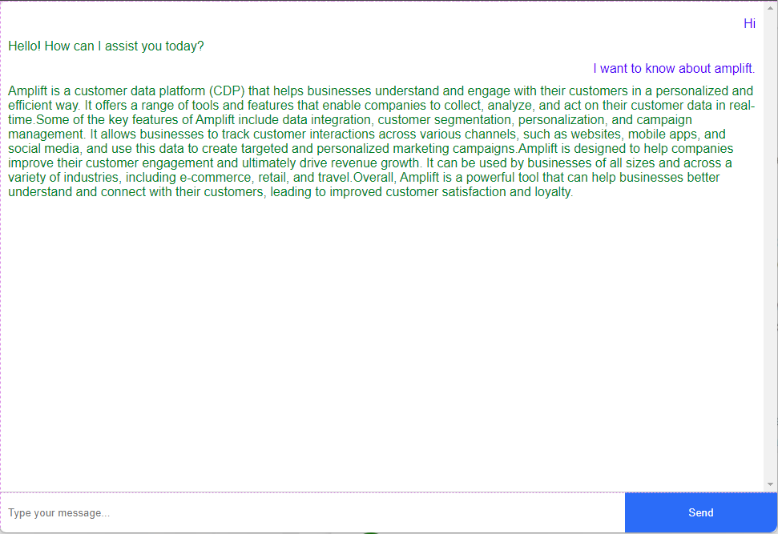

## Test project for Junior Backend Developer at Amplift
### Objetive
The objective of this test is to evaluate the candidate's ability to work with backend
technologies, specifically integrating with the GPT SDK, and implementing key features that
are crucial for an early-stage startup. The candidate should demonstrate proficiency in API
development, SDK integration, and handling real-world backend scenarios. 

### Functionalities
- User can input query
- Frontend page calls RESTful API to get response from GPT model.
- Backend generates streamed response and forwards it to html page.
### Requirements
- Python 3.x
- Flask >2.x

### Set up environments
- Create virtual environment
```python
python -m venv env
```
- Install dependency python packages
```python
pip install -r requirement.txt
```

### Notice
You should replace openai API key in `openai_key.txt`

### Developer
Reach out to me `westcannon226@gmail.com`